# Authentication

Please create a separate Eufy account to which you share your devices with admin rights.
The minimal configuration requires that you enter a username and a password.

!> If you enter the login data incorrectly several times, the Eufy Cloud also requests a captcha check after a certain amount of failed attempts. If two factor authentication is activated, the captcha check is carried out first and then the 2FA.

!> Please be careful because if you try to log in incorrectly many times, your account may be banned for 24 hours.

## Captcha authentication

After a certain amount of failed login attempts, the Eufy Cloud also requests a captcha verification as follows.
You will find the status of the adapter in the left menu under the item 'Instances' as follows: yellow and marked with a warning triangle.

  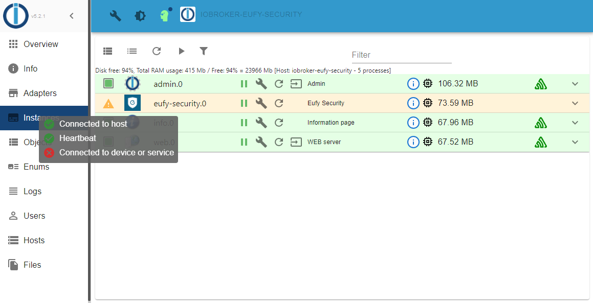

1. Select `Logs` in the left menu and check why the adapter is in a yellow state. In this case, the cause is the captcha request from Eufy Cloud.

  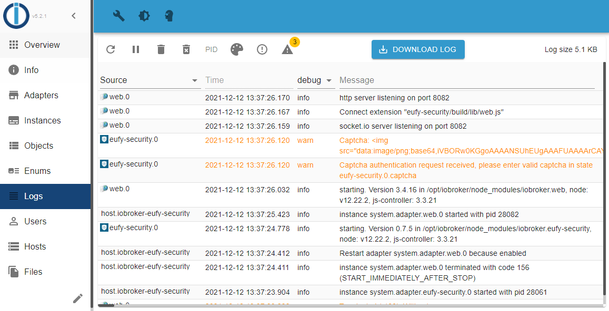

2. At the top press `DOWNLOAD LOG` and select `current`.

  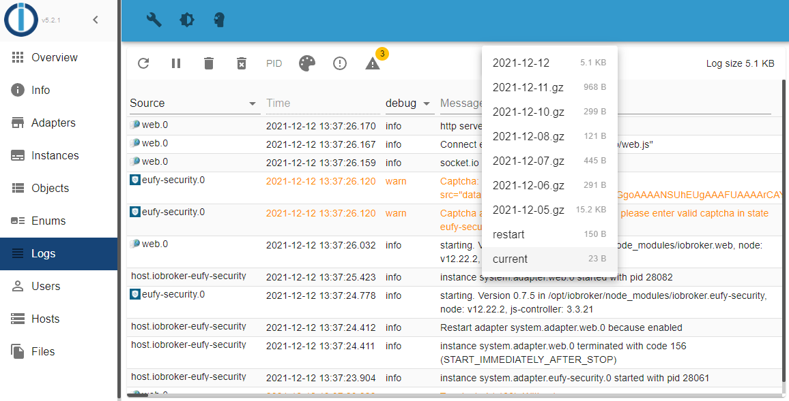

3. This opens a new browser window where the captcha is legible. Make a note of the code and move forward.

  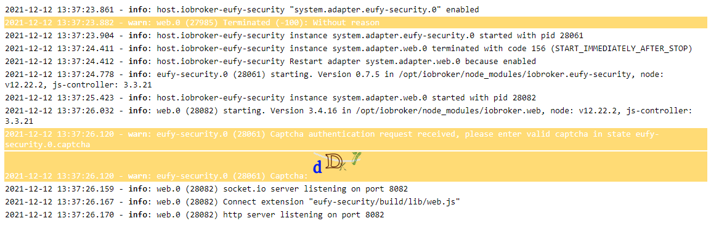

4. Now go to the left menu and select 'Objects'. Then on the right side under `eufy-security` => `0` click in the line `captcha` the button with the pencil symbol.

  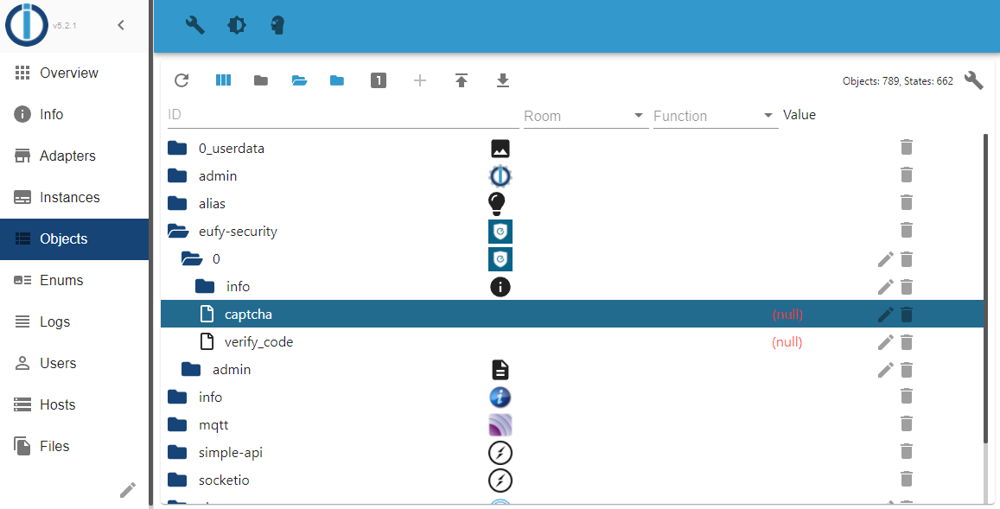

5. Here you enter the captcha code and click on 'SET VALUE'.

  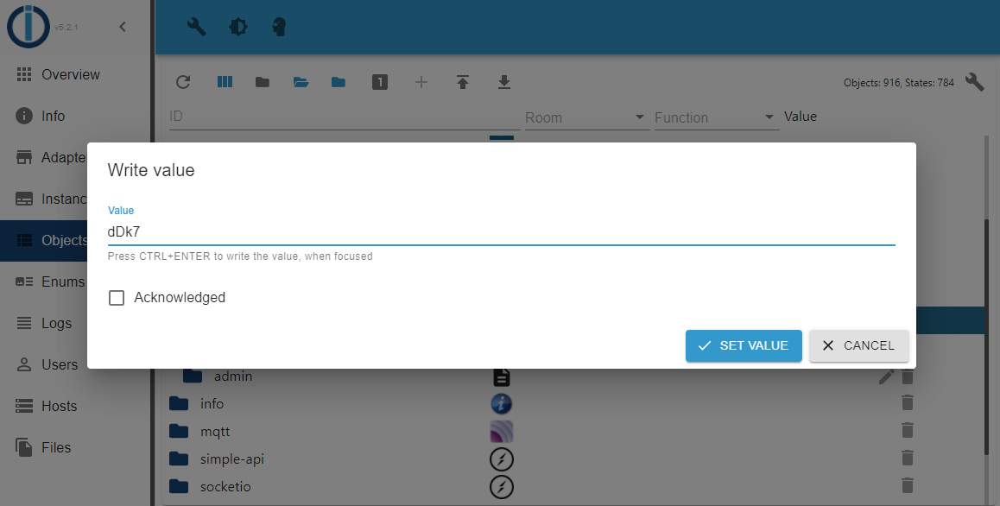

  !> Do not tick `Acknowledged` under any circumstances. If you select this option, the entry will be ignored and you will have to do this step again.

  ?> You have 30 seconds to enter the captcha code. If you take longer or enter it incorrectly, a new captcha code will be generated by Eufy and you will have to perform this step again with the new code.

6. Go back to the instances view and check if the status of the adapter is now green. If it is you are good to go, else go back to the logs view and check the messages.
In this example, 2FA was enabled and therefore you need to perform 2FA (see next chapter below).

  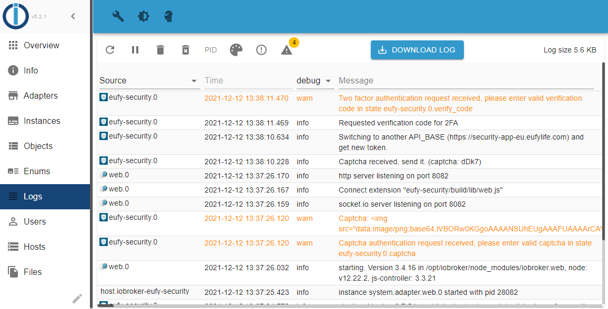

## Two factor authentication (2FA)

If you have activated 2FA, you will find the status of the adapter in the left-hand menu under the item 'Instances' after authentication with user name and password as follows: yellow and marked with a warning triangle.

  

1. Go back to the log view (left-hand menu `Logs`) and you will see that you have to perform the 2FA.

  

2. Now check the mail of your Eufy account. You should find the following mail.

  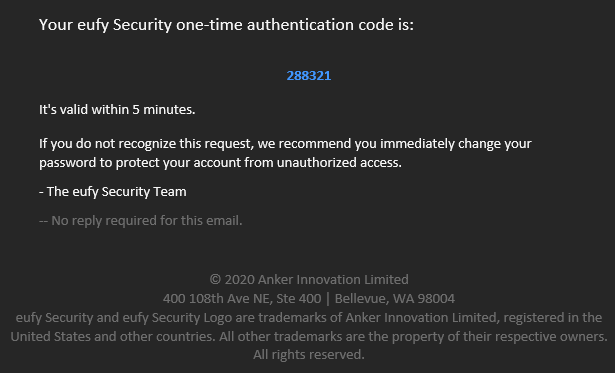

3. Now go to the left menu and select 'Objects'. Then on the right side under `eufy-security` => `0` click in the line `verify_code` the button with the pencil symbol.

  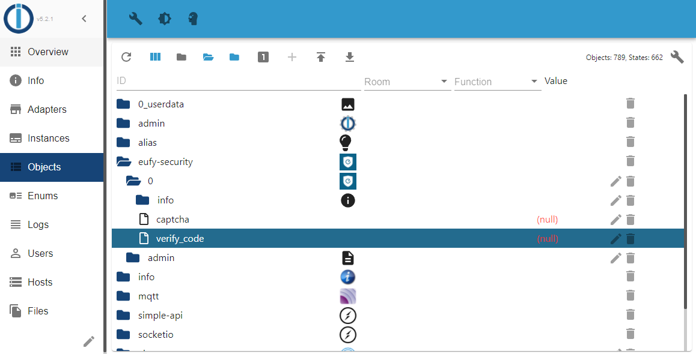

4. Here you enter the verify code and click on 'SET VALUE'.

  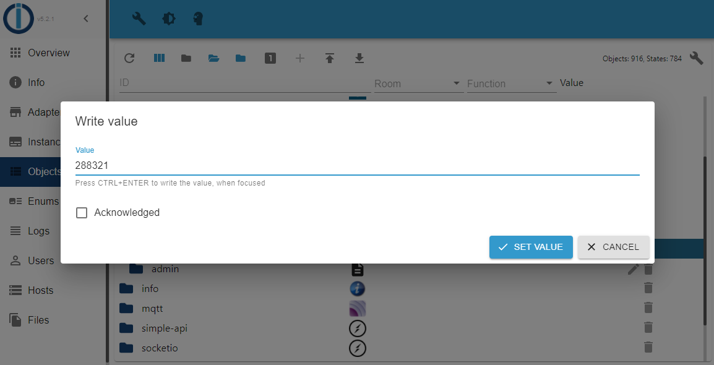

  !> Do not tick `Acknowledged` under any circumstances. If you select this option, the entry will be ignored and you will have to do this step again.

  ?> You have 5 minutes to enter the verify code. If you take longer or enter it incorrectly, you need to restart the adapter to get a new one and you will have to perform this step again with the new code.

5. Go back to the instances view and check if the status of the adapter is now green. If it is you are good to go, else go back to the logs view and check the messages.

  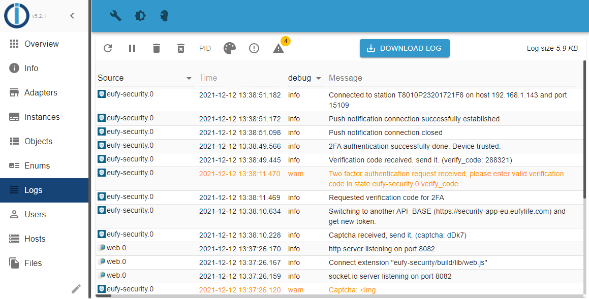

  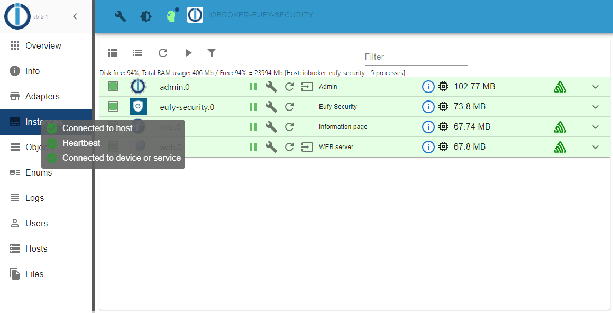