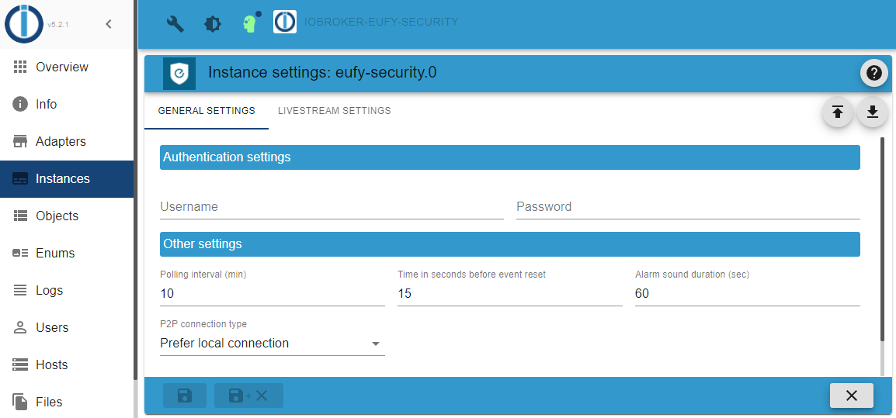
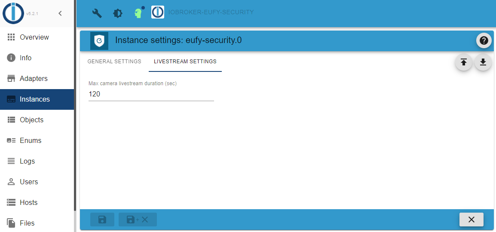

# Configuration

Please create a separate Eufy account to which you share your devices with admin rights.
The minimal configuration requires that you enter a username and a password.
See below for more configuration parameters.

## General settings

  

  | Configuration parameter | Description |
  | - | - |
  | Username | Your Eufy account username |
  | Password | Your Eufy account password |
  | Polling intervall (min.) | The data is retrieved from the Eufy Cloud again every x minutes |
  | Time in seconds before event reset | Time in seconds before a motion event, person detected event, etc. is reset |
  | Alarm sound duration (sec) | Time in seconds after the triggered alarm is silenced. |
  | P2P connection type | Choose which P2P connection you prefer. |
  | Accept incoming invitations | Share invitation are automatically accepted if enabled. |

### Parmeter: P2P connection type

  | Choosable value | Description |
  | - | - |
  | Prefer local connection | An attempt is made to establish the P2P connection with the local address of the respective Eufy device; if this is not possible, an attempt is made to establish the connection via the Eufy Cloud. |
  | Only local connection | It will only try to establish the P2P connection with the local address of the respective Eufy device. |
  | Quickest connection | It tries to establish the fastest possible P2P connection with the respective Eufy device, regardless of whether it is local or via the Eufy Cloud. |

## Livestream settings

  

  | Configuration parameter | Description |
  | - | - |
  | Time in seconds before event reset | Time in seconds before a motion event, person detected event, etc. is reset |
