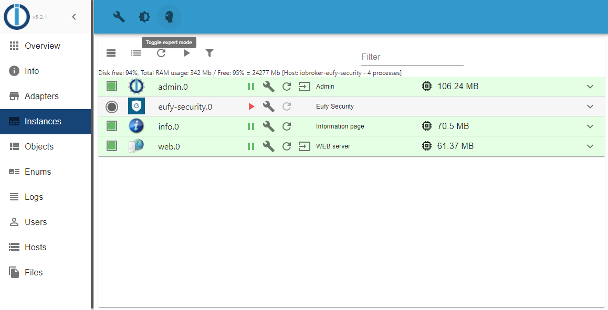
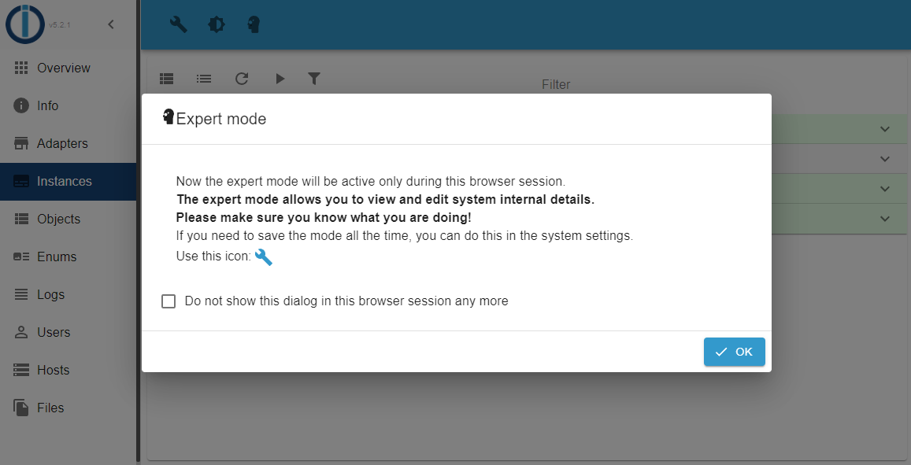
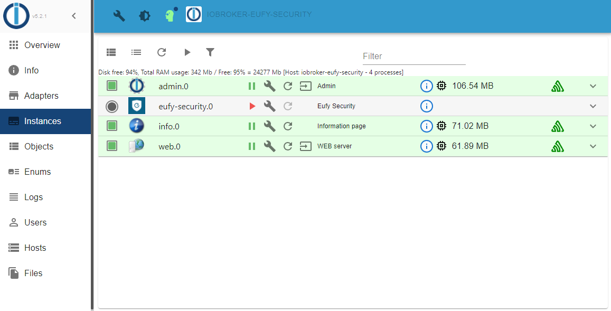
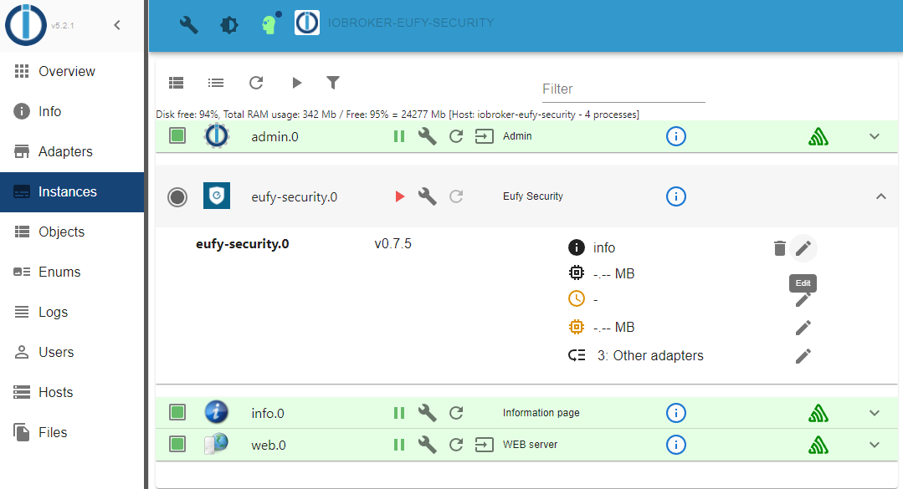
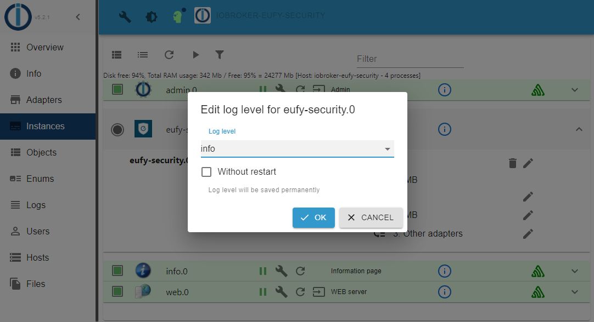
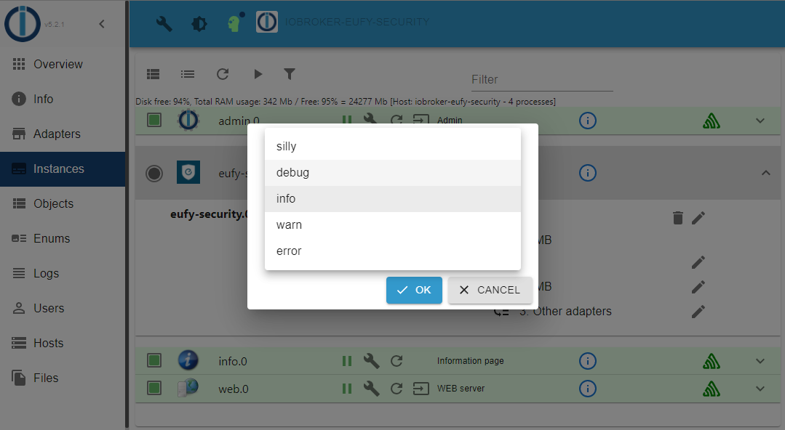
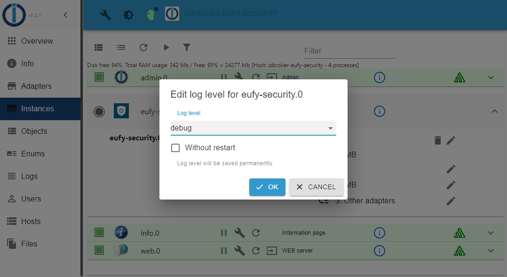
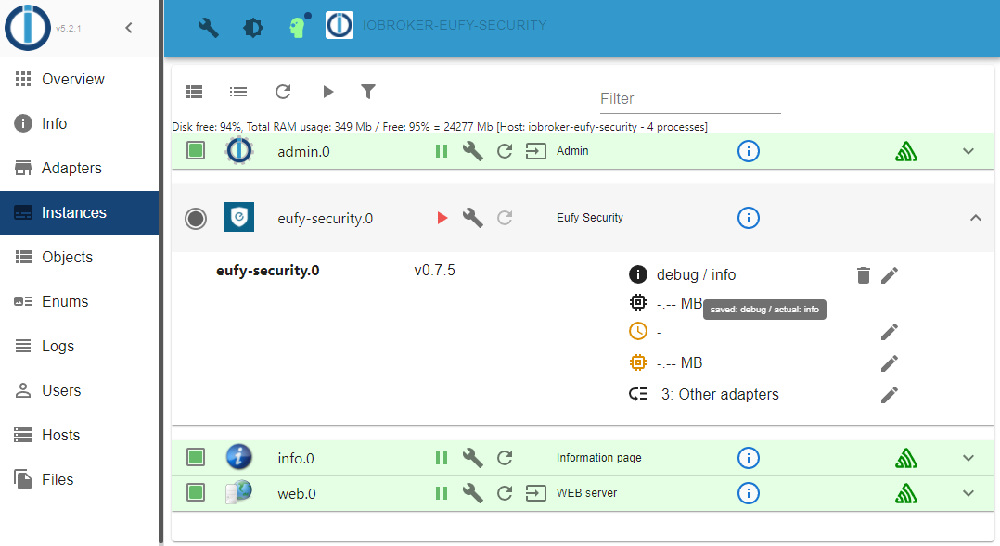

# Debugging

## Enable debug

To set the adapter in debug mode, proceed as follows.

1. Select `Instances` in the left menu and click on the head symbol at the top to activate the expert mode.

  

2. Confirm the following window with `OK`.

  

3. Now click in the line of the 'eufy-security.0' adapter on the far right on the arrow pointing downwards.

  

4. Now click on the button with the pencil (edit) on the far right in the first line, at the level of the version of the adapter.

  

5. Now choose `debug` and confirm with `OK`.

  
  
  

6. Debug mode is configured.

  

In my example, the adapter was already stopped and therefore you have to start it so that it accepts the new log level.
If the adapter was already active and you did not select `Without restart`, the adapter will be restarted automatically.

## Disable debug

To disable the debug mode of the adapter, follow the previous chapters and set `Log Level` to `info`.

