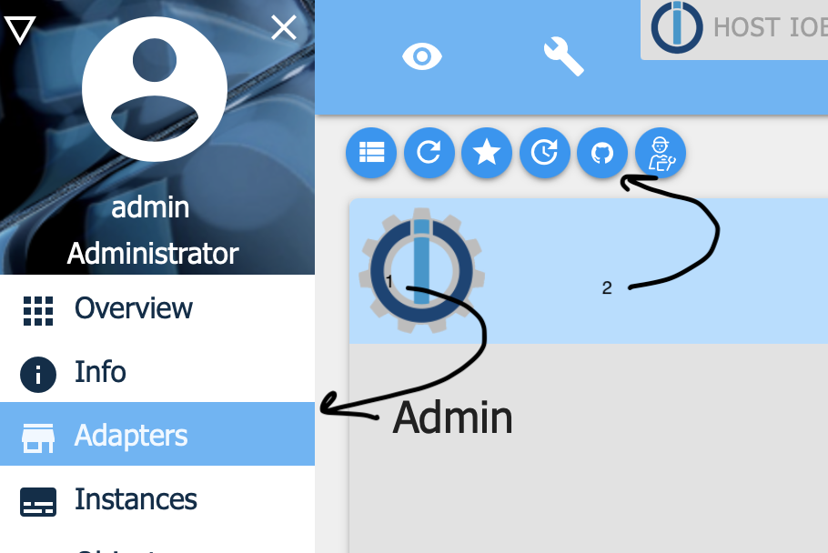
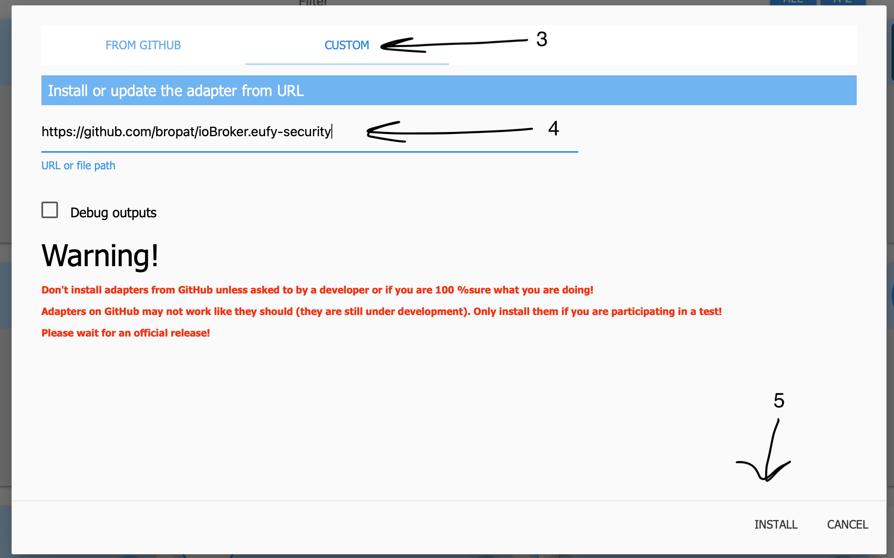
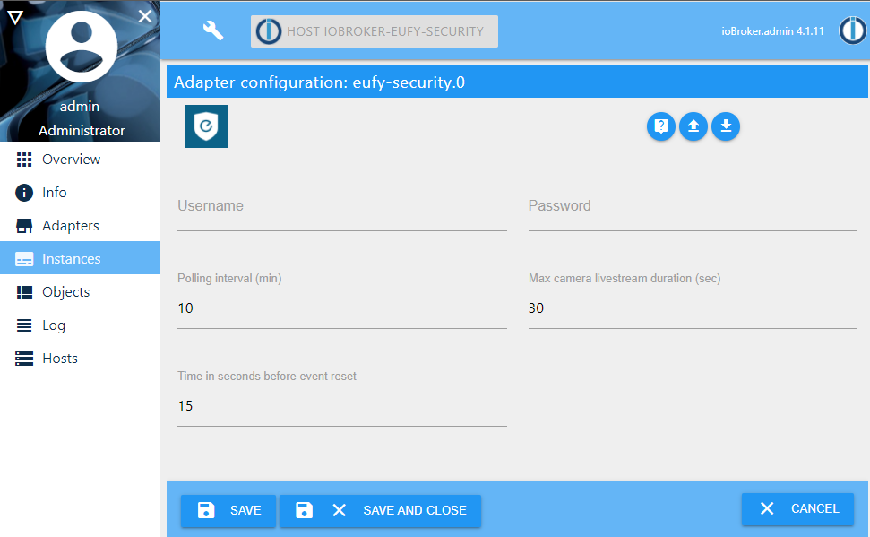
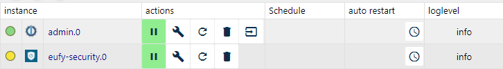
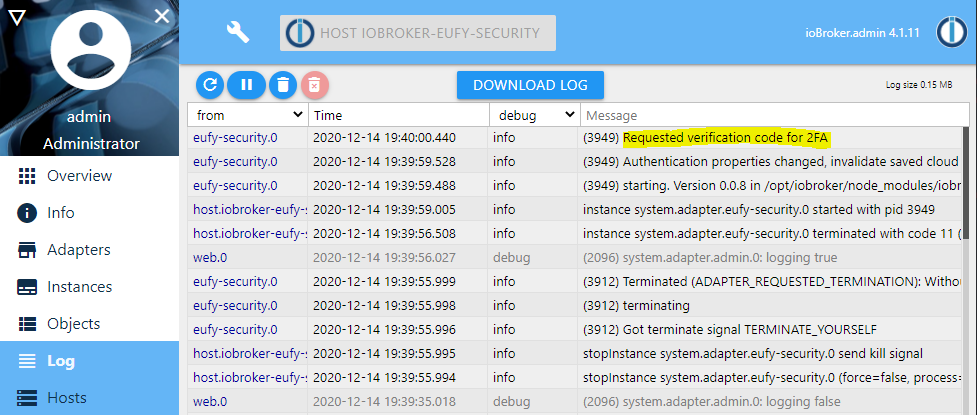
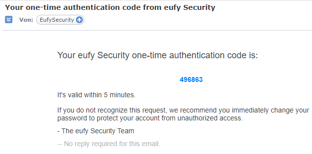
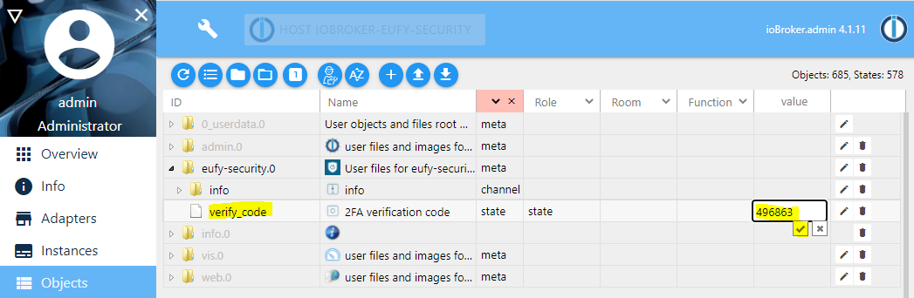
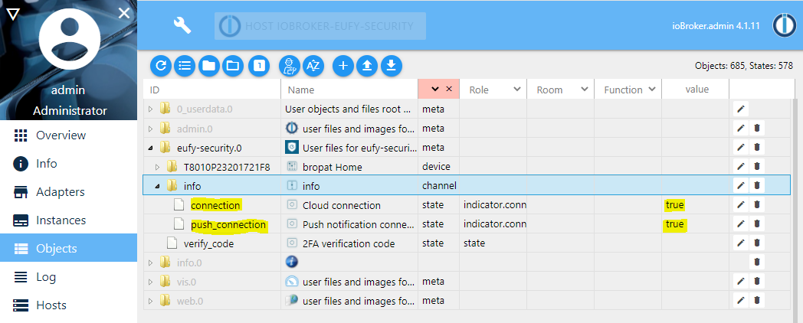
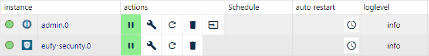

# Adapter Eufy-Security
## Installation

Of course, first install ioBroker in the usual way.

Follow these steps to install Eufy-ecurity into ioBroker:

1. Select Adapters in the left menu
2. Choose Install from custom URL

3. Select the Custom tab
4. Enter the url to eufy-security: https://github.com/bropat/ioBroker.eufy-security
5. Click Install

Wait until the adapter has finished installing and continue with configuration.

## Updating
Updating the plugin with the latest release can be done by following the installation manual again. Configuration will be kept safe and the new version will simply take over.

## Configuration

Coniguration parameter | Description
- | -
Username | Your Eufy account username
Password | Your Eufy account password
Polling intervall (min.) | Every x minutes the data is queried again from the Eufy Cloud
Max camera livestream duration (sec.) | Maximum duration of a live stream in seconds
Time in seconds before event reset | Time in seconds before a motion event, person detected event, etc. is reset

### Two Factor Authentication

The adapter detects automatically if the Eufy account has the 2FA enabled and requests a verification code by mail. The state of the adapter instance will be yellow:

In the ioBroker Logs view you will see the following message:

Take the verification code from the received mail:

Go to the ioBroker Objects view and navigate to the `eufy-security.0.verify_code` state, enter the received verification code and confirm:

The entered verification code will disappear. 
The object tree will be updated and you will see the following:

Now go to the ioBroker Instances view and you will see that the status has also changed to green:

