# Installation

!> **Prerequisite**: You must already have ioBroker with the `web` adapter installed.

?> __Note__: At the time of writing, the adapter is still in beta and not available in the stable ioBroker branch.

1. Open a browser and go to the ioBroker Admin page (default port: 8081).

  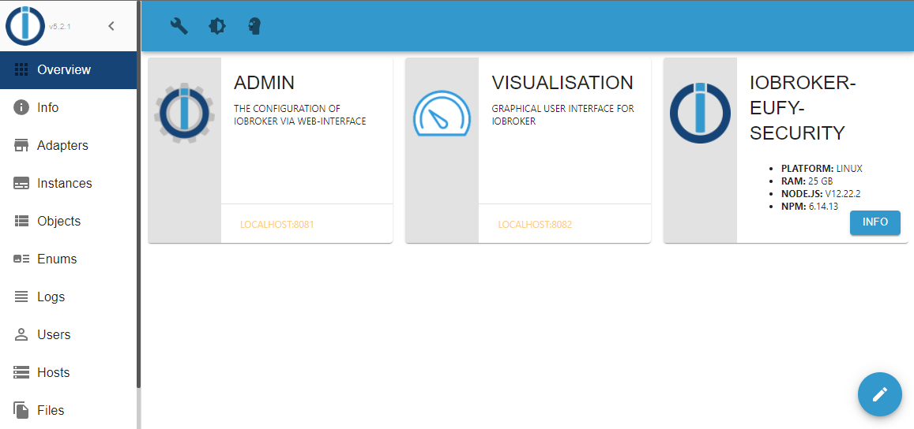

2. Select the item `Adapters` in the menu on the left.

  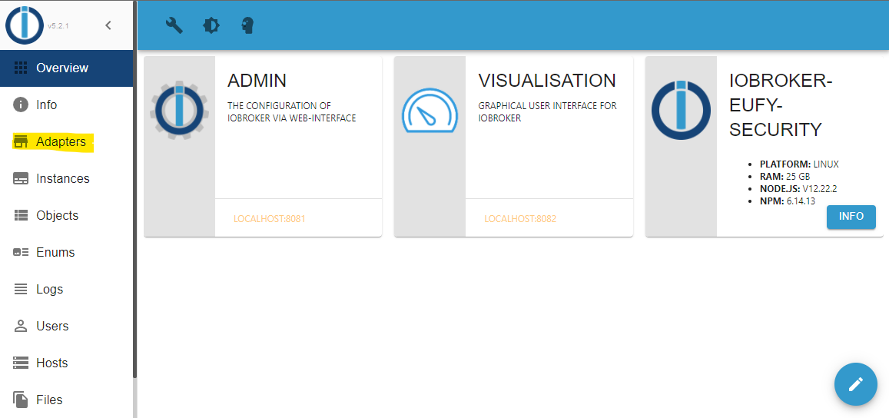

3. Press the button with the head symbol at the top.

  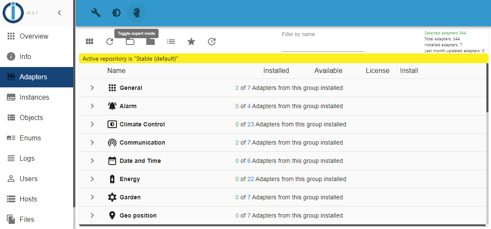

4. You will see the following window. Close it with `OK`.

  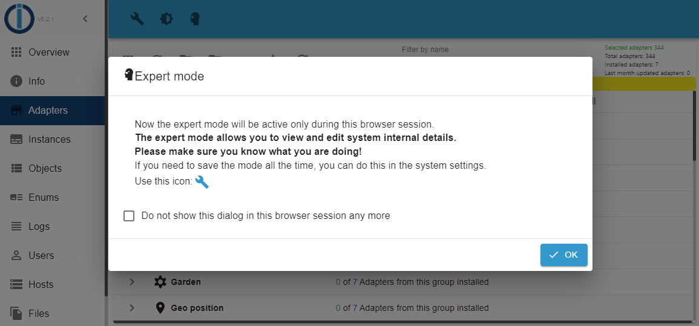

5. Now you should see a button with the symbol of a cat at the top. Press it and continue.

  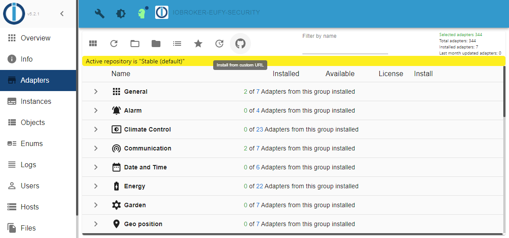

6.Select `CUSTOM` at the top.

  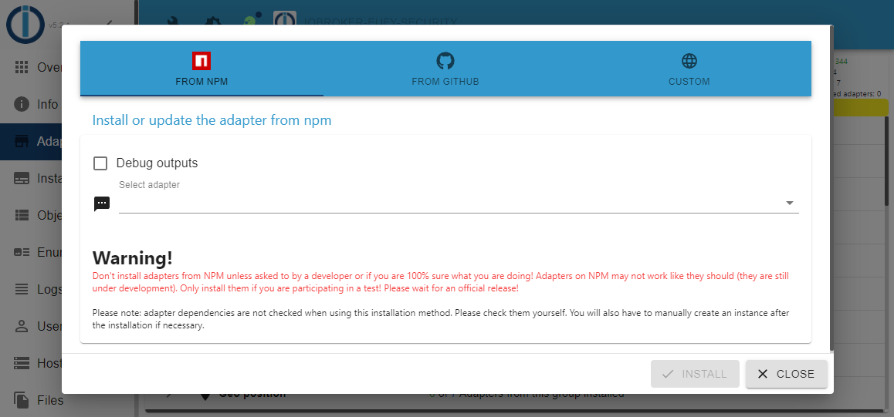

7. Fill in the following value under URL and proceed with `INSTALL`.

  Url: https://github.com/bropat/ioBroker.eufy-security

  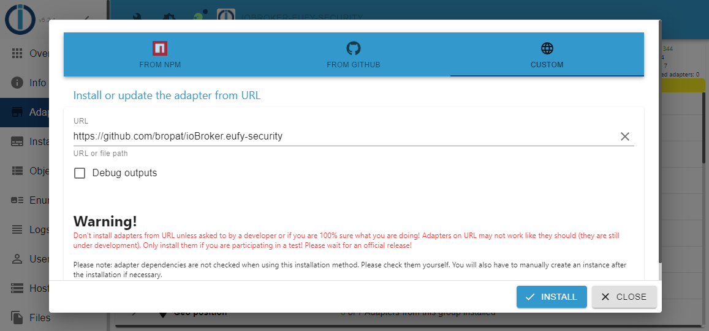

8. After the installation is complete, close the following window with `CLOSE`.

  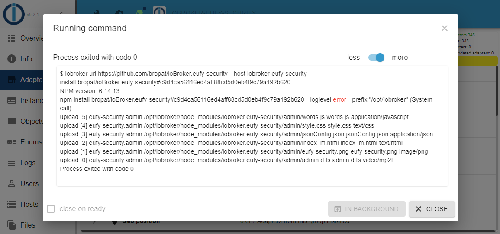

9. Write the keyword `eufy` in the `Filter by name` field at the top centre and select `Add instance` with `+` to install the adapter.

  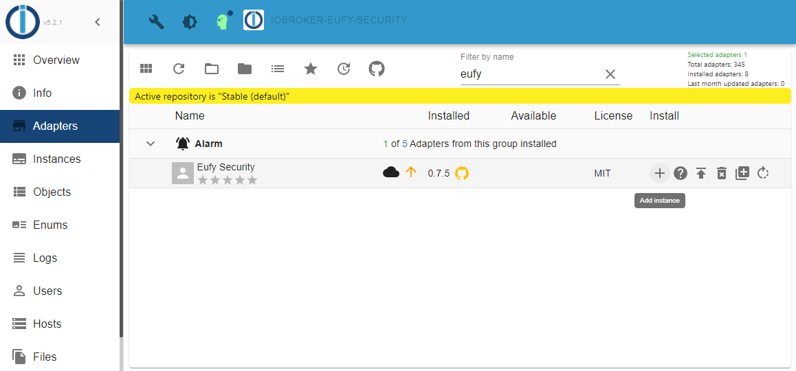

10. Select `ADD` and proceed.

  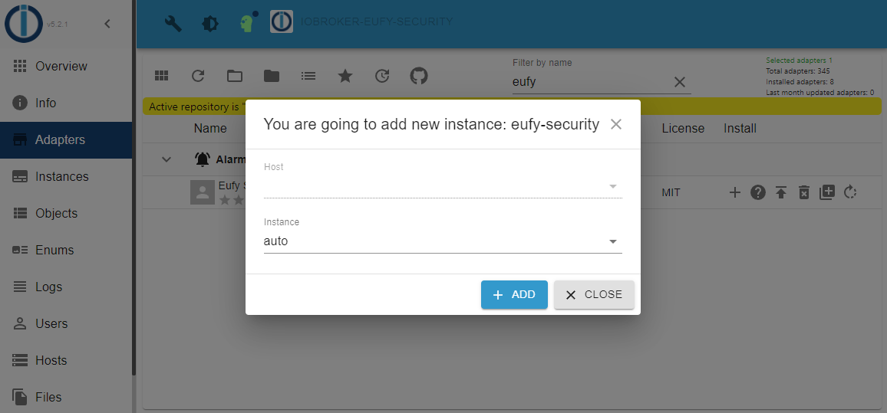

11. Close the following window with 'Close' and jump to the next chapter [Configuration](/configuration).

  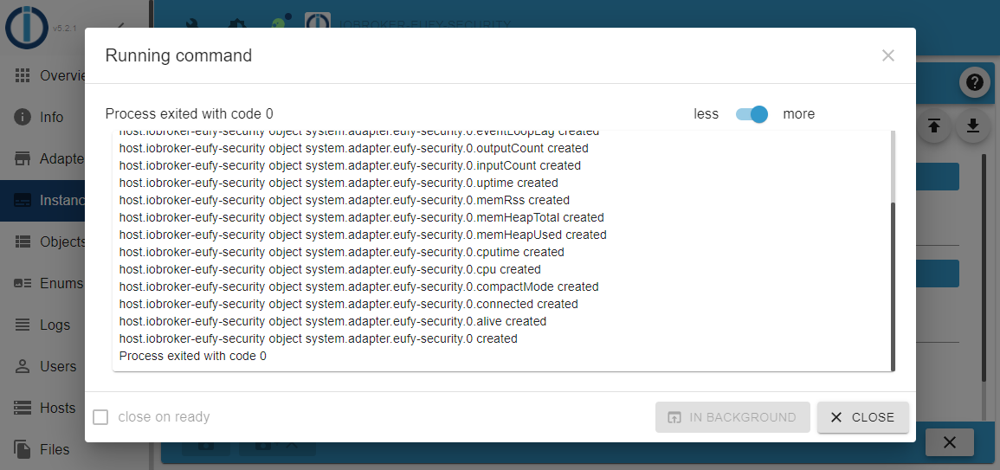

12. Please fill in the username and password and press `SAVE + CLOSE`.

  !> Please create a separate Eufy account to which you share your devices with admin rights.

  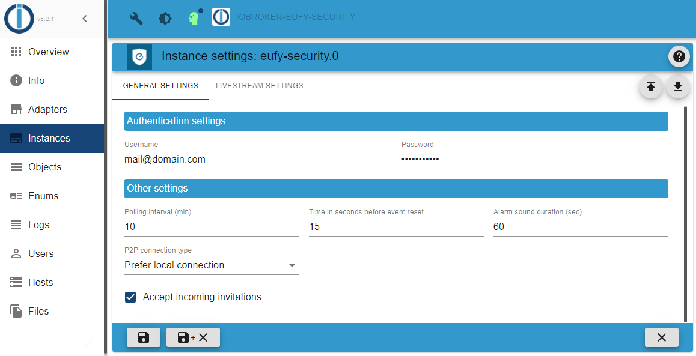

13. If no captcha or 2FA authentication is required, the status of the adapter should now be green, otherwise yellow.

  

  If the status is yellow, go to the chapter [Authentication](/authentication).

